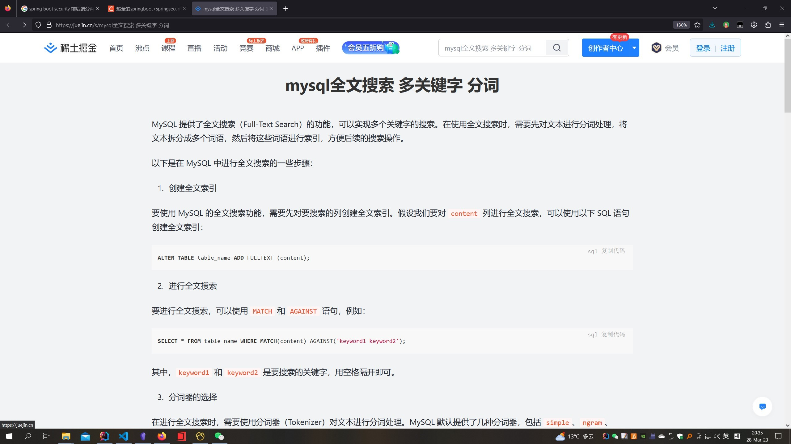

MySQL 提供了全文搜索（Full-Text Search）的功能，可以实现多个关键字的搜索。在使用全文搜索时，需要先对文本进行分词处理，将文本拆分成多个词语，然后将这些词语进行索引，方便后续的搜索操作。

以下是在 MySQL 中进行全文搜索的一些步骤：

1.  创建全文索引

要使用 MySQL 的全文搜索功能，需要先对要搜索的列创建全文索引。假设我们要对 `content` 列进行全文搜索，可以使用以下 SQL 语句创建全文索引：

```sql
ALTER TABLE table_name ADD FULLTEXT (content);
复制代码
```

2.  进行全文搜索

要进行全文搜索，可以使用 `MATCH` 和 `AGAINST` 语句，例如：

```sql
SELECT * FROM table_name WHERE MATCH(content) AGAINST('keyword1 keyword2');
复制代码
```

其中，`keyword1` 和 `keyword2` 是要搜索的关键字，用空格隔开即可。

3.  分词器的选择

在进行全文搜索时，需要使用分词器（Tokenizer）对文本进行分词处理。MySQL 默认提供了几种分词器，包括 `simple`、`ngram`、`whitespace` 等。如果需要更加精细的分词操作，也可以使用第三方的分词器，例如中文分词器 `jieba`。要选择使用哪种分词器，可以在创建全文索引时指定。

例如，如果要使用 `jieba` 中文分词器，可以使用以下 SQL 语句创建全文索引：

```sql
ALTER TABLE table_name ADD FULLTEXT (content) WITH PARSER jieba;
复制代码
```

这样，就可以在进行全文搜索时使用 `jieba` 分词器对中文文本进行分词处理了。

希望以上信息对你有所帮助。

[原文在此](https://juejin.cn/s/mysql%E5%85%A8%E6%96%87%E6%90%9C%E7%B4%A2%20%E5%A4%9A%E5%85%B3%E9%94%AE%E5%AD%97%20%E5%88%86%E8%AF%8D)


有趣的是这个文章在juejin网站的地址：
https://juejin.cn/s/mysql%E5%85%A8%E6%96%87%E6%90%9C%E7%B4%A2%20%E5%A4%9A%E5%85%B3%E9%94%AE%E5%AD%97%20%E5%88%86%E8%AF%8D
常理来讲，不会在网站设计一个这样占据画面中央的单独一篇文章。


